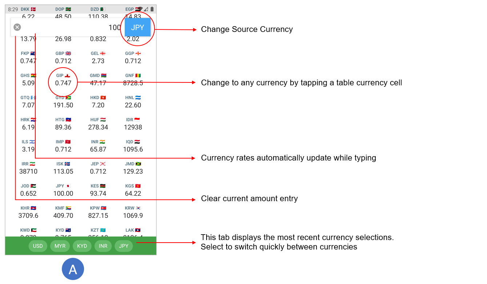
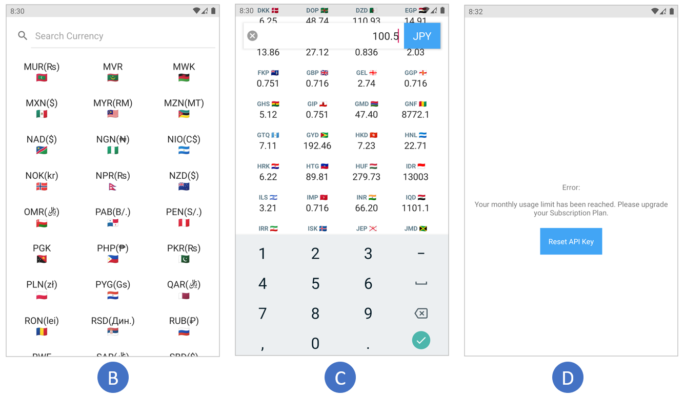
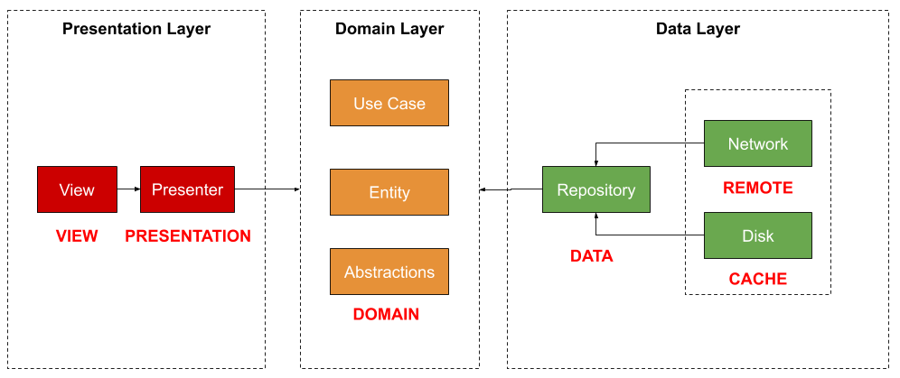

# Currency Exchange App 

A multi-module currency exchange app built on the principles of clean architecture design.

  * [Technical Goals](#technical-goals)
  * [App Screenshots & Overview](#app-screenshots---overview)
  * [App Design](#app-design)
    + [View Module](#view-module)
    + [Presentation Module](#presentation-module)
    + [Domain Module](#domain-module)
    + [Data Module](#data-module)
    + [Remote Module](#remote-module)
    + [Cache Module](#cache-module)
  * [Testing](#testing)
    + [UI Testing](#ui-testing)
    + [ViewModel Testing](#viewmodel-testing)
    + [Data Repository Testing](#data-repository-testing)
    + [Room Database Testing](#room-database-testing)
    + [Other Unit Testing](#other-unit-testing)
  * [Other Key Libraries](#other-key-libraries)
    + [Dagger 2](#dagger-2)
    + [LeakCanary](#leakcanary)
    + [Kotlin Framework](#kotlin-framework)
    + [Dependencies setup](#dependencies-setup)
  * [Team Collaboration Compliant](#team-collaboration-compliant)
  * [Key References](#key-references)

## Technical Goals
The main objective is to develop it using a modern architecture that is very compliant with a team development setting.
* Adheres to *Clean Architecture* design principles.
* Maintainable, scalable and flexible (adaptable to future growth, modifications and new requirements).
* Modular code with clear separation of concerns and well defined responsibility for classes, modules/layers. Highly testable.
* Eliminate frictions between teams/individuals working on a project. Promotes accountability in a collaborative way.
* Uses widely recognized libraries to support the implementation of key requirements of the app

## App Screenshots & Overview





* Change currency by selecting a cell or clicking the currency button. (A)
* The currency dialog offers a quick search functionality (B)
* The table exchange rates automatically updates while typing on the keypad (C)
* The app design supports an architecture that allows errors to be elegantly displayed to the UI when needed (D)
* The app properly supports orientation changes by retaining view properties using `ViewModel`.
* The app is using [CurrencyLayer](https://www.currencylayer.com) API for exchange rate information. Note that the free version of the API has many limitations, particularly the source currency cannot be changed from USD. Because of this, and to be able to convert between other currencies, additional calcualtions will need to be performed that involved calculating the rates by going from *source currency* to *USD rate* to *target currency*. This will be covered in more detail the `Data` layer section below.

## App Design
The app architecture is organized into several layers, namely the presentation, domain, and the data layers.



* **Presentation**- contains the `View` and `Presentation` modules of the app. The view module contains the activities and fragments that are coordinated through the Presenter/ViewModel.
* **Domain**- `Domain` module is at the core of our application, that contains the business logic. It should not depend on how the data will be presented or where the data is coming from, as such, this is the most inner part that has no dependencies to the outer layers. It defines *use cases* which declare operations that can be performed. 
* **Data**- contains the repository implementations, and is also responsible for coordinating data from the  the network data source (via the `Remote` module) and the local storage data source (via the `Cache` module). 

In this architecture, some operation may take place within each module or adjacent modules- such as view coordination (`View` →  `Presentation`) or server retrieval/caching (`Remote` → `Data` → `Cache`). It can even pass through all the layers (`View` →  `Presentation` →  `Domain` →  `Data` →  `Remote`), such as displaying the list of items when starting the app

### View Module
This module is responsible for handling the user display components. The architecture goal is to ensure that the view layer is completely unaware of the logic of how the views are being controlled. It's core responsibility should be managing the display of the view elements. This also makes it relatively easier to swap diferrent view modules or layouts depending on the needs of the business. This module uses the following libraries and approaches:
* Uses a `single activity architecture` utilizing  a `NavHost` is used to handle the swapping of Fragment destinations. `Navigation Component` libraries are used to create a navigation graph to declare navigational actions.
* `DataBinding`, in conjuction with `BindingAdapter` is heavily leveraged to bind observable data directly to UI elements in the XML layouts, minimizing boilerplate code in the fragments or activities employing them. Two-way data binding is used on the input `EditText` to listen for changes in text input.
* `ListAdapter` is used as the `RecyclerView` adapter becuase it works very well with `DataBinding` and handle changes in adapter values internally.
* `Chip` widgets are used to display recent 5 currency selections, on a FIFO (*first in first out*) order. A `Stack` collection is used to save the recent currencies.
* Views are coordinated by subscribing to `Livedata` inside `ViewModels` contained in the `Presentaion` module. Views essentialy reacts to changes in observed data, and are thus this layer is effectively decoupled from the other parts of the program, making it very easy to replace, modify or maintain.
* `Sealed classes` are used to manage the state transition between the `View` and `Presentation` modules.

### Presentation Module
This module is responsible for making calls to the data sources, as well as coordinating the `LiveData` sources that helps coordinates the view elements on the `View` module. The `Presentation` module depends on the `Domain` layer. This module uses the following libraries and approaches:
* `ViewModel` - store and manage UI-related data in a lifecycle conscious way. The ViewModel class allows data to survive configuration changes such as screen rotations. The ViewModels are instantiated using a Dagger module, outside of their owning activities and fragments. A custom ViewModelFactory is used to allow injecting dependencies into ViewModels. On this single activity architecture design, the ViewModels are also responsible for pasing data between fragments.
* `LiveData` is used a lifecycle-aware observable that ensure view component observers are in active lifecycle. Note that only non-mutable LiveData are exposed to observers outside the `Presentation` module, which by design safely prevents outside components from changing the state of the observable.
* `RxJava` -  used to instantiate observers and pass it to call the `Domain` *use cases* where it would then be subscribed into. The `Domain` layer has no knowledge of it's observers in this scenario thus keeping it isolated from the rest of the program.
* A common issue with LiveData is that its observers are getting re-notified even after orientation changes. To prevent cases we clearly do not want this behaviour, such as an error observer showing the same toast message after rotation, we are using a custom `EventObserver` that checks whether an event has not been handled previously before notifying it's observers.
* In many cases, the data classes (models) used by the `View` and `Presentation` layer slightly varies from the models inside the Domain layer. For this cases, mapper utility classes are used to transform models from one module layer to another.

In general, this architecture is best described as `Clean Architecture` using *MVVM* design pattern. Also, the app adopts principles of *reactive and functional programming* through use of observables and observers and schedulers. For example, the presentation layer waits to be notified by the domain layer when a network call is made. The UI layer waits to be notified by livedata objects to display view changes. Many of this calls has to be performed asynchronously and schedulers helps with thread management, such as using RxJava's `observeOn` to tell observers which thread they should run on. My goal was to end up with a more cleaner, readable, and structured code base and this helped a lot.

### Domain Module
This module is purely a Kotlin library with **NO Android dependencies**. The domain calls for subscribing it's observers into the main UI thread, for this, I created an abstraction for the main thread that will be implemented in the `View` module (using `AndroidSchedulers.mainThread`) so that the domain layer can be free of the Android framework. This module uses the following libraries and approaches:
* This layer contains the various *use cases*. The domain defines all the rules that the program must comply with. For this, they receive the data provided by the user and perform the necessary operations. For example, a use case for `GetExchangeRate` defines the parameters and outputs for getting exchange rate.
   
   With this setup, as the requirements of the app grows and more features are added, it would be easy to add more *use cases* without affecting other parts of the program. This supports the goals of this app for scalability and flexibility.
   
* `RxJava` - use to build *use case observables* and for subscribing it's observers.
* This module defines an abstraction of the data repository (`DomainRepository`) that will be iplemented in the `Data` module of the app and injected using `Dagger`.

### Data Module
This module is purely a Kotlin library with **NO Android dependencies**. This module depends on the `Domain` and is responsible for the concrete implementation of the `DomainRepository`. The concrete impplementation is binded using a Dagger module, keeping the `Domain` isolated. 

* This module defines the abstraction for the remote (`RemoteRepository`) and cache (`CacheRepository`) repository, that will be implemented in the `Remote` and `Cache` module respectively.
* This modules defines the data class that is required to be supplied by the `Remote` and the `Cache`. Mapper classes are used to transform the data into domain form (again, keeping the domain independent).
* The main library used is RxJava- and it's sued to construct observable chains that defines the logic of how the data will be obtained from the data sources (`Remote` and `Cache`), including error management when an exception occurs. For instance, the following is a snippet of the code that is used to obtain the exchange rate:

```kotlin
    override fun getExchangeRate(
        inputCurrency: String,
        outputCurrencies: List<String>?
    ): Observable<ExchangeRate> {

        return localRepo.getCachedTimeStamp("USD") //gets cached timestamp
            .onErrorReturnItem(0) //cache should return 0 if empty, or when there's error
            .map { dataStore.getDataStore(if (timeUtils.isCacheValid(it)) CACHE else REMOTE) }
            .flatMap { repo ->
                when (inputCurrency == "USD") {
                    true -> repo.getExchangeRate("USD", outputCurrencies)
                        .flatMap {
                            when (repo is CacheDataStore) {
                                true -> Observable.just(it)
                                else -> localRepo.saveExchangeRates(it).andThen(Observable.just(it))
                            }
                        }
                    else -> repo.getExchangeRate("USD", outputCurrencies)
                        .flatMap {
                            when (repo is CacheDataStore) {
                                true -> Observable.just(it)
                                else -> localRepo.saveExchangeRates(it).andThen(Observable.just(it))
                            }
                        }
                        .zipWith(
                            localRepo.getExchangeRate("USD", listOf(inputCurrency)),
                            BiFunction { t1, t2 ->
                                mapper.mapRatesToNonUsdCurrency(
                                    inputCurrency = inputCurrency,
                                    uSdExchangeData = t1,
                                    nonUsdExchangeData = t2
                                )
                            })
                }
            }
            .map { mapper.mapToExchangeRate(it) }
    }
```
**RxJava Chain Overview**
* Checks local repository for latest timestamp. Returns 0 if empty (or error)
* Selects either the cached or remote data source depending on the amount of time since the cached data was saved (30 minutes cache time limit)
* If using remote source, retrieve the data and store it to the cache
* Map the retrieved currency rates to the `Data` module reuirements
* The free `CurrencyLayer` API only allows for USD as the input source. If the source is other than USD, perform a currency rate conversion by calculating the exchange rate between the source currency and it's USD rate equivalent. `RxJava` `BiFunction` is used to take the two parameters, perform calculations and emit the needed exchange rates.

**Log Output**
* As seen below, the first time the app was run, it detected that cache was more than 30 minutes, and thus retrieving the exchange rate information from the remote server.
```
I/System.out: ^^ Cache: getting timestamp
I/System.out: ^^ Cache data is 26231406.5789 minutes old
I/System.out: ^^ Remote: Getting rate for all currencies
I/System.out: ^^ Cache: Saving exchange rate
```
* The next time the app was run, it detected that cache was less than 30 minutes, and thus retrieving the exchange rate information from the local cached data source.
```
I/System.out: ^^ Cache: getting timestamp
I/System.out: ^^ Cache data is 0.30261666666666664 minutes old
I/System.out: ^^ Cache: Getting rate for all currencies
```

### Remote Module
This module is purely a Kotlin library with **NO Android dependencies**. This module depends on the `data` module and is responsible for the concrete implementation of the `RemoteRepository`. The concrete impplementation is binded using a Dagger module, keeping the `Data` module independent of this module. 

I am using `Retrofit` in conjuction with `OkHttpClient` as client service to accessing server data. `Retrofit` makes it relatively easy to retrieve JSON via a REST based webservice. I've added a cache interceptor to the `OkHttpClient` as a convenient way to cache the information to the local storage for a more responsive app (by limiting network request when data is not that old) and some offline caching.

Since I will need to know if the device has Internet connection, I've created a `NetworkUtil` interface with a `hasConnection()` function. Checking for device connetion requires access to `Application` context, and to to keep this module free from Android dependencies, the concrete implementation of `NetworkUtil` will be provided using Dagger.

### Cache Module
This module depends on the `data` module and is responsible for the concrete implementation of the `CacheRepository`. The concrete impplementation is binded using a Dagger module, keeping the `Data` module independent of this module. .
 
The local data source will be setup and accessed using the `Room` Library. The `Room` persistence library provides an abstraction layer over `SQLite` to allow for more robust database access while harnessing the full power of `SQLite`. `Room` is used to save the data retrieved from the server in certain situations. The `Data` module will orchestrate what data needs to be saved and retrieved, this module is only responsible for implementing how specific local database operations will be done.

`GSON` library is used to convert the quotes `Map` information into `JSON` format and vice versa. The quotes are stored in `JSON` format into the `Room` database.

## Testing

### UI Testing
UI testing of the view layer is performed by using the `Espresso` testing framework. To ensure that the tests do not fail due to a server fault, I used a similar `Dagger` setup to allow a mock injection of the `DomainRepository`. The UI test performs the following operation:
* Launches the app
* Retrieves a preconfigured list of exchange rates information from the mocked repository.
* Scroll to each item on the table
* Check that the item currency matches the expected value
* Check that the item exchange rate matches the expected value
* Test completes

### ViewModel Testing
Testing of the `ViewModel` is done by mocking the `Domain` response using `Mockito`. An `ArgumentCaptor` is used to capture arguments for mocked methods. It is used with `Mockito` `verify()` methods to get the arguments passed when any method is called. This way, we can provide additional `JUnit` assertions for our tests.

### Data Repository Testing
`DataRepository` testing is done by mocking the `Remote` and `Cache` data sources. A `TestObserver` is used to directly run the `Observables`, where we can then perform `JUnit` assertions on the responses. For example, to test the [`Data Module`](#data-module) code presented above, the following test code is used:

```kotlin
    @Test
    fun getExchangeRate() {

        whenever(localRepo.getCachedTimeStamp("USD"))
            .thenReturn(Observable.just(123))

        whenever(timeUtils.isCacheValid(any()))
            .thenReturn(false)

        val exchangeRateData = makeExchangeRateData()

        whenever(remoteRepo.getExchangeRate(any(), eq(null)))
            .thenReturn(Observable.just(exchangeRateData))

        whenever(localRepo.getExchangeRate(any(), any()))
            .thenReturn(Observable.just(exchangeRateData))

        whenever(localRepo.saveExchangeRates(any()))
            .thenReturn(Completable.complete())

        val observer = dataRepository.getExchangeRate("USD", null).test()

        val value = observer.values().first()

        assertEquals(
            value, ExchangeRate(
                source = exchangeRateData.source,
                quotes = exchangeRateData.quotes,
                timestamp = exchangeRateData.timestamp
            )
        )
    }
```

### Room Database Testing
Room database testing is done by creating an in-memory version of the database to make the tests more hermetic. The test check for data insertion and checking back that the data retrieved matches the expected value.

### Other Unit Testing
`Retrofit` client testing is done by mocking the client and making `JUnit` assertions on the responses. `JUnit` testing were also done on testing the `Mapper` classes to ensure that they are mapping data classes correctly.

## Other Key Libraries

### Dagger 2
The app use `Dagger` with `AndroidInjector` module for dependency injection. `Dagger` setup is done at the `View` module where it will be responsible for binding a module interfaces to it's concrete implementation contained in another module. For instance, binding `DomainRepository` interface to a `DataRepository` class.

All dependencies are injected into classes. That is, classes should have specific responsibilities and not be responsible nor have any information of how it's dependencies are created. This decoupled approach also helps improve the testability of the app, and is also a key principle of `Clean Architecture`.

The modules are organized into the following:
* `AppModule` - Responsible for creating application context dependent objects, such as Toast
* `CacheModule` - Responsible for creating the Room Database object, as well as the local database access object
* `DataModule` - Responsible for creating the concrete implementaion of the data repositories defined on the domain layer
* `RemoteModule` - Responsible for creating the Retrofit service, as well the remote server access object
* `UiModule` - Responsible for setting up injecting into Android frameworks, such as fragments and activities. Also responsible for binding the domain scheduler into the main UI thread
* `ViewModelModule` - Responsible for concrete instantiation of ViewModel classes

### LeakCanary
`LeakCanary` was used to detect and anticipate potential memory leaks. LeakCanary’s knowledge of the internals of the Android Framework gives it a unique ability to narrow down the cause of each leak, helping dramatically reduce `OutOfMemoryError` crashes. The app yielded *0% memory leaks* through extensive debug testing.

### Kotlin Framework
* Data classes
* Sealed classes
* Kotlin functional programming
* Extension Functions
* KTX extensions
* Coroutines

### Dependencies setup
Multiple libraries are used in this app. To mantain consistency and coherence, a single source of library versions is used and is contained in the projects `build.gradle` file. Also, since this app uses a multi-module architecture, it ensures that when a library updates, all modules using the same library are updated to thelatest version.

```
 ext{
        //Android Libraries
        appcompat_version = '1.1.0'
        ktx_version = '1.1.0'
        lifecycle_version = '2.1.0'
        viewmodel_version = '2.2.0-alpha05'
        room_version = '2.2.0-rc01'
        constraint_layout_version = '1.1.3'
        cardview_version = '1.0.0'
        nav_fragment_version = '2.2.0-alpha03'

        //3rd Party Libraries
        javax_inject_version = '1'
        dagger_version = '2.22.1'
        retrofit_version = '2.6.0'
        okhttp_version = '3.12.3'
        rxandroid_version = '2.1.1'
        rxkotlin_version = '2.3.0'
        rxjava_version = '2.2.9'
        leakcanary_version = '2.0-beta-3'
        kotlin_serialization_version = '0.11.1'

        //Test Libraries
        junit_version = '4.12'
        androidx_test_runner_version = '1.2.0'
        espresso_version = '3.2.0'
        mockito_kotlin_version = '2.1.0'
```

## Team Collaboration Compliant
One of the key goals is to design this app that is compliant with a team development setting. I believe this kind of architecture that is loosely coupled with well defined responsibilities and separation of concerns helps eliminate frictions between members and promotes accountability in a collaborative way. In an agile environment, changing framework or libraries if needed should be relatively easy, because a good architecture is about designing layers and business rules/interfaces so that questions like framework or type of database becomes irrelevant.

## Key References
* CurrencLayer: https://currencylayer.com
* Guide to App Architecture: https://developer.android.com/jetpack/docs/guide
* Clean Architecture: https://proandroiddev.com/how-to-implement-a-clean-architecture-on-android-2e5e8c8e81fe
